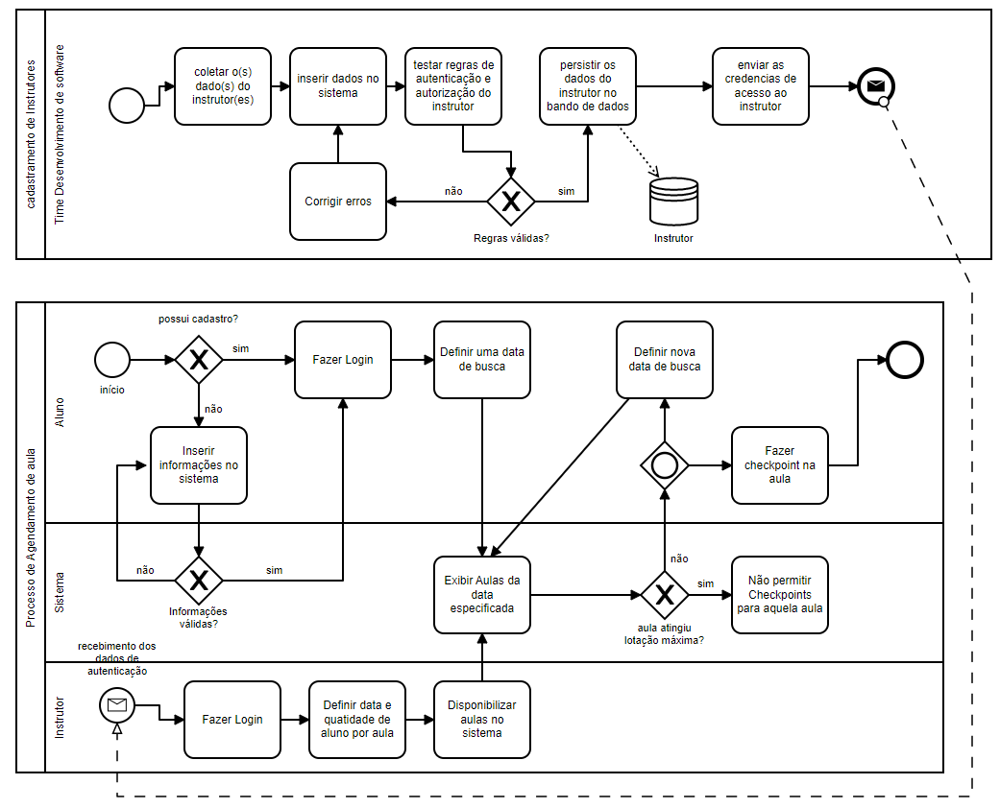
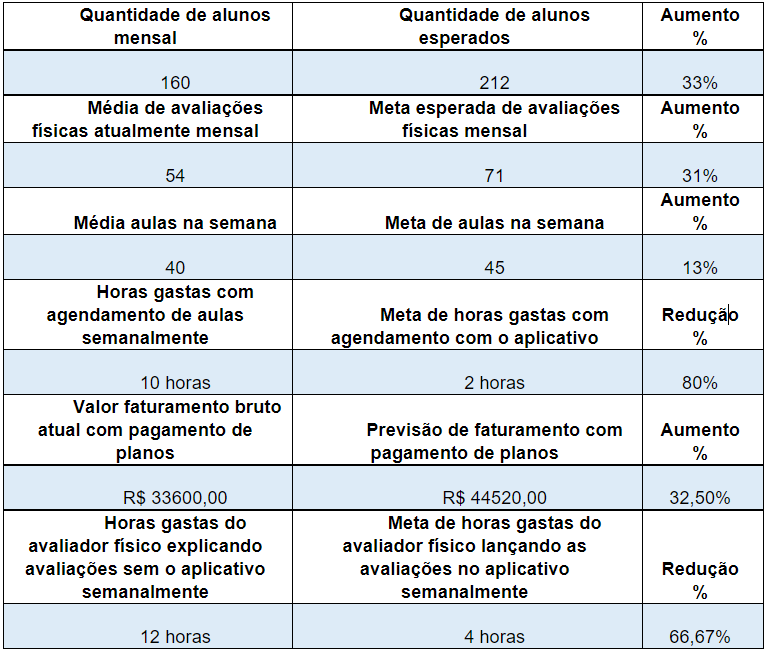
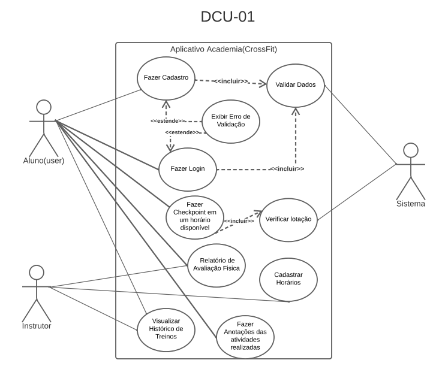
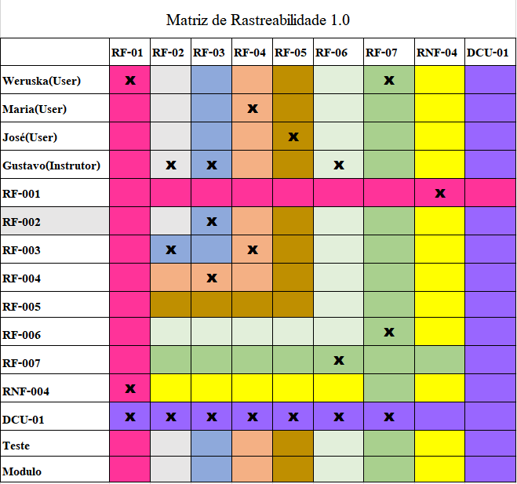
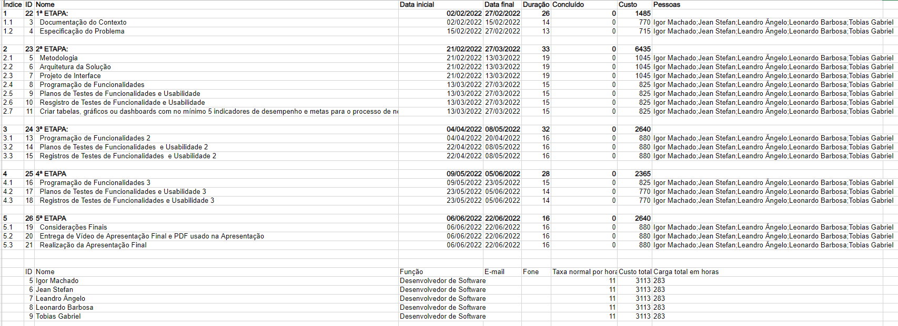
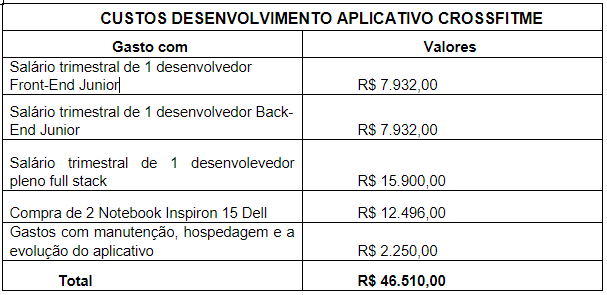

# Especificações do Projeto

Pré-requisitos: <a href="1-Documentação de Contexto.md"> Documentação de Contexto</a>

A definição do problema e os pontos mais relevantes abordados no projeto foi consolidada com a participação dos usuários em um trabalho de imersão feito pelos membros da equipe a partir da observação dos usuários em seu local natural e por meio de entrevistas.
Segue abaixo, todos os detalhes que especificam a abordagem do projeto...

## Personas

Weruska Aparecida

Weruska tem 20 anos, namora há 4 anos com Leonardo e mora em Divinópolis-Mg. Atualmente está no 7º período da faculdade de Fisioterapia a noite e trabalha como estagiária de 08:00 às 13:00 de segunda a sexta-feira. Como ela tem uma vida muito corrida, aonde é complicado conciliar os estudos e o trabalho, ela está procurando uma atividade física de no máximo 1 hora com alta intensidade para definir o seu corpo e vê essa oportunidade praticando CrossFit. Mas ela não quer ter horário marcado para realizar essa atividade e procura uma academia de CrossFit com diversos horários para realizar a aula e que possui um aplicativo para fazer o agendamento, assim não corre o risco de chegar no local e estar cheio.

Maria Eduarda

Maria Eduarda tem 37 anos, casada há 7 anos com seu marido Fábio e com um filho de 3 anos. Reside em Divinópolis-Mg e trabalha como Analista de Dados na empresa Logus de 08:00 as 17:00 de segunda a sexta-feira. Ela tem como objetivo emagrecer pois não está feliz com seu peso e com seu corpo no momento e está em busca de uma atividade física dinâmica, onde os exercícios não são repetitivos e que consegue realizar com mais pessoas. Ela ficou interessada em fazer CrossFit, mas como procura resultados rápidos, está em busca de um local que realiza avaliações físicas todo mês e que tem à disposição um aplicativo para fazer o acompanhamento desses resultados.

José Maria

José Maria tem 33 anos, solteiro e reside em Divinópolis-Mg. Trabalha atualmente como atendente de pessoa física no banco Safra de segunda a sexta-feira de 08:30 as 17:30. Ele é apaixonado por esportes, joga futebol 2 vezes na semana e faz ciclismo também 2 vezes. Está procurando alguma atividade para aumentar sua resistência e força física. Ficou interessado no CrossFit e está em busca de um plano para treinar 3 vezes na semana porque tem pouca flexibilidade de horários devido ao trabalho e as outras atividades que pratica e busca uma academia de CrossFit que possui um aplicativo que consiga realizar o agendamento dos dias e horários na semana que ele pode treinar.

Gustavo Henrique

Gustavo Henrique tem 29 anos, namora há 3 anos com Patrícia e reside em Divinópolis. Fez faculdade de Educação Física, se formou há 4 anos e atualmente é dono de uma academia de CrossFit, que se chama Youbox. Ele tem como Hobbies fazer viagens com a namorada e passar o tempo livre assistindo seriado. Ele é apaixonado pelo trabalho e tem como objetivo fazer o lançamento o mais rápido possível do aplicativo da sua academia, que vai ter as funcionalidades de agendamento das aulas pelos alunos, economizando tempo de seus funcionários e evitando um cliente chegar e não ter vaga, pois são limitadas a quantidade de pessoas por horário e também o aluno conseguirá visualizar a sua avaliação física, que depois de feita o instrutor físico vai disponibilizar a mesma no aplicativo.

## Histórias de Usuários

Com base na análise das personas forma identificadas as seguintes histórias de usuários:

| EU COMO... `PERSONA` | QUERO/PRECISO ... `FUNCIONALIDADE`                                        | PARA ... `MOTIVO/VALOR`                          |
| -------------------- | ------------------------------------------------------------------------- | ------------------------------------------------ |
| Weruska Aparecida    | Praticar atividade física de alta intensidade em uma academia de CrossFit | Definir o corpo                                  |
| Maria Eduarda        | Realizar atividades físicas dinâmicas em uma academia de CrossFit         | Emagrecimento                                    |
| José Maria           | Treinar 3 vezes na semana em uma academia de CrossFit                     | Aumento de resistência e força física            |
| Gustavo Henrique     | Fazer o lançamento do aplicativo da sua academia de CrossFit              | Facilitar a vida de seus funcionários e clientes |

## Modelagem do Processo de Negócio

### Análise da Situação Atual

Atualmente a academia de crossfit não possui um sistema de agendamento de aulas. Portanto, um dos grandes problemas verificados é a recusa de alunos participarem dos treinos, devido a limitação de vagas. Além disso, o relatório de avaliação física do aluno, disponibilizado pelo instrutor é em papel impresso.
Assim, claramente, verifica-se uma possibilidade de ganhos tanto aos alunos, instrutores quanto à academia. Com sistema de agendamento espera-se um aumento considerável na quantidade de alunos recebidos. Também é claro a redução do tempo e recursos gastos com geração do relatório atráves do sistema.

### Descrição Geral da Proposta

Apresente aqui uma descrição da sua proposta abordando seus limites e suas ligações com as estratégias e objetivos do negócio. Apresente aqui as oportunidades de melhorias.

### Processo 1 e Processo 2 – Cadastramento de instrutor e Agendamento de aula.

## Indicadores de Desempenho

Apresente aqui os principais indicadores de desempenho e algumas metas para o processo. Atenção: as informações necessárias para gerar os indicadores devem estar contempladas no diagrama de classe. Colocar no mínimo 5 indicadores.

Usar o seguinte modelo:

## Requisitos

As tabelas que se seguem apresentam os requisitos funcionais e não funcionais que detalham o escopo do projeto. Para determinar a prioridade de requisitos, aplicar uma técnica de priorização de requisitos e detalhar como a técnica foi aplicada.

### Requisitos Funcionais

| ID     | Descrição do Requisito                                                                                                      | Prioridade |
| ------ | --------------------------------------------------------------------------------------------------------------------------- | ---------- |
| RF-001 | O usuário deve conseguir fazer cadastro e login no aplicativo.                                                              | ALTA       |
| RF-002 | O instrutor da academia deve cadastrar os horários disponíveis para treino.                                                 | ALTA       |
| RF-003 | O instrutor deve cadastrar a lotação máxima por horário.                                                                    | ALTA       |
| RF-004 | O usuário deve conseguir fazer o checkpoint para o treino, em determinado horário, caso esse não esteja com lotação máxima. | ALTA       |
| RF-005 | O usuário deve conseguir visualizar o histórico de seus treinos.                                                            | MÉDIA      |
| RF-005 | O instrutor deve divulgar o relatório de avaliação física dos seus usuários.                                                | MÉDIA      |
| RF-005 | O usuário deve conseguir visualizar o seu relatório de avaliação física.                                                    | MÉDIA      |

### Requisitos não Funcionais

| ID      | Descrição do Requisito                                                       | Prioridade |
| ------- | ---------------------------------------------------------------------------- | ---------- |
| RNF-001 | O app deve ser acessível através de sistemas operacionais “Android” e “iOS”. | ALTA       |
| RNF-002 | O app deve ser desenvolvido utilizando React Native.                         | ALTA       |
| RNF-003 | O app deve criptografar dados sensíveis do usuário.                          | ALTA       |
| RNF-004 | O app deve estar disponível 24 horas por dia e 07 dias da semana.            | MÉDIA      |

## Restrições

O projeto está restrito pelos itens apresentados na tabela a seguir.

| ID  | Restrição                                             |
| --- | ----------------------------------------------------- |
| 01  | O projeto deverá ser entregue até o final do semestre |
| 02  | Não pode ser desenvolvido um módulo de backend        |

## Diagrama de Casos de Uso

Na Linguagem de modelagem unificada (UML), o objetivo do diagrama de caso de uso é demonstrar as diferentes maneiras que o usuário pode interagir com um sistema.

Dessa forma os alunos e instrutores (atores primários) podem interagir com o sistema (ator secundário), no contexto de treino funcional, da seguinte forma:

# Matriz de Rastreabilidade

A matriz de rastreabilidade é uma ferramenta usada para facilitar a visualização dos relacionamento entre requisitos e outros artefatos ou objetos, permitindo a rastreabilidade entre os requisitos e os objetivos de negócio.

# Gerenciamento de Projeto

De acordo com o PMBoK v6 as dez áreas que constituem os pilares para gerenciar projetos, e que caracterizam a multidisciplinaridade envolvida, são: Integração, Escopo, Cronograma (Tempo), Custos, Qualidade, Recursos, Comunicações, Riscos, Aquisições, Partes Interessadas. Para desenvolver projetos um profissional deve se preocupar em gerenciar todas essas dez áreas. Elas se complementam e se relacionam, de tal forma que não se deve apenas examinar uma área de forma estanque. É preciso considerar, por exemplo, que as áreas de Escopo, Cronograma e Custos estão muito relacionadas. Assim, se eu amplio o escopo de um projeto eu posso afetar seu cronograma e seus custos.

## Gerenciamento de Tempo

## Gerenciamento de Equipe

O gerenciamento adequado de tarefas contribuirá para que o projeto alcance altos níveis de produtividade. Por isso, é fundamental que ocorra a gestão de tarefas e de pessoas, de modo que os times envolvidos no projeto possam ser facilmente gerenciados.

## Gestão de Orçamento

O processo de determinar o orçamento do projeto é uma tarefa que depende, além dos produtos (saídas) dos processos anteriores do gerenciamento de custos, também de produtos oferecidos por outros processos de gerenciamento, como o escopo e o tempo.

