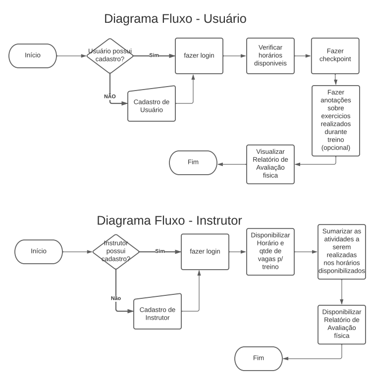
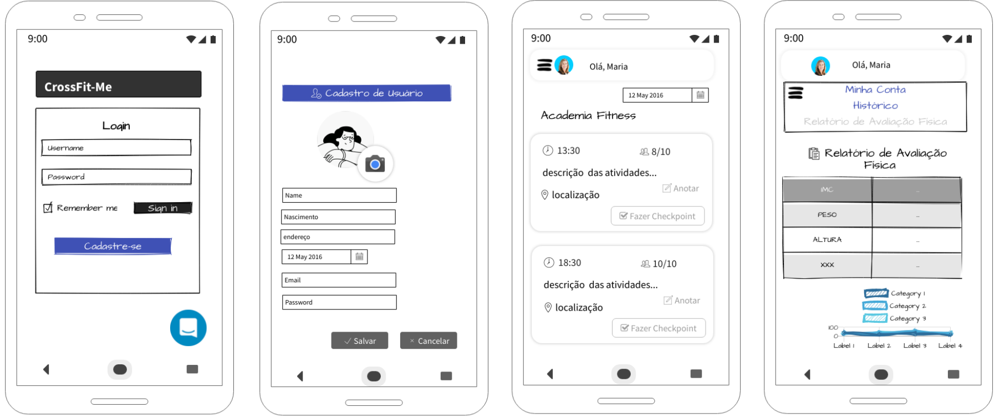

# Projeto de Interface

Visão geral da interação do usuário pelas telas do sistema e protótipo interativo das telas com as funcionalidades que fazem parte do sistema (wireframes).

## Diagrama de Fluxo

O diagrama apresenta o estudo do fluxo de interação do usuário com o sistema interativo e  muitas vezes sem a necessidade do desenho do design das telas da interface. Isso permite que o design das interações seja bem planejado e gere impacto na qualidade no design do wireframe interativo que será desenvolvido logo em seguida.

## Wireframes

Conforme o diagrama de fluxo do projeto, apresentado no item anterior, as telas do sistema são apresentadas em detalhes nos itens que se seguem. 

As telas do sistema buscam padronizar a navegação, como apresentado na Figura X. Nesta estrutura, existem 3 grandes blocos, descritos a seguir. São eles: 

●	Menu Superior - local onde são dispostos elementos de identidade (logo) e navegação de telas / funcionalidades; 

●	Conteúdo - apresenta o conteúdo da tela em questão; 

●	Menu Inferior - apresenta os elementos de navegação secundária, geralmente associados aos elementos do bloco de conteúdo.  

São protótipos usados em design de interface para sugerir a estrutura de um site web e seu relacionamentos entre suas páginas. Um wireframe web é uma ilustração semelhante do layout de elementos fundamentais na interface.
 
> **Link**:
> - [Wireframes Completo](https://www.nngroup.com/videos/prototypes-vs-wireframes-ux-projects/)

