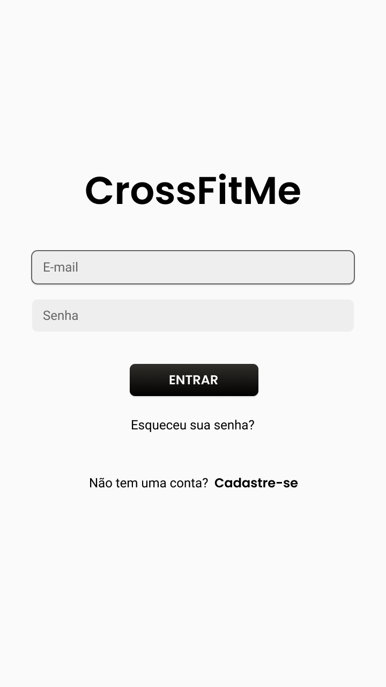
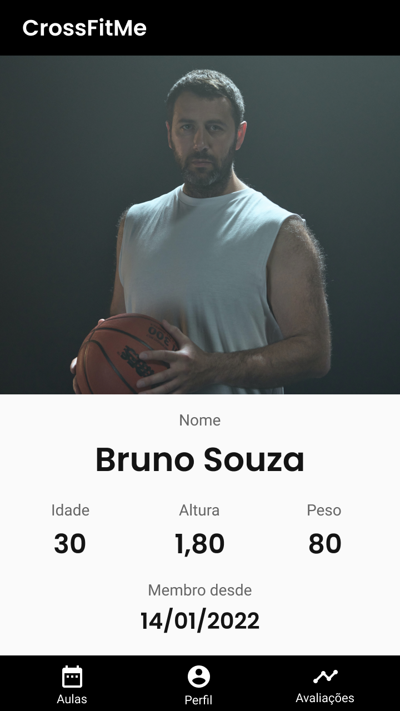
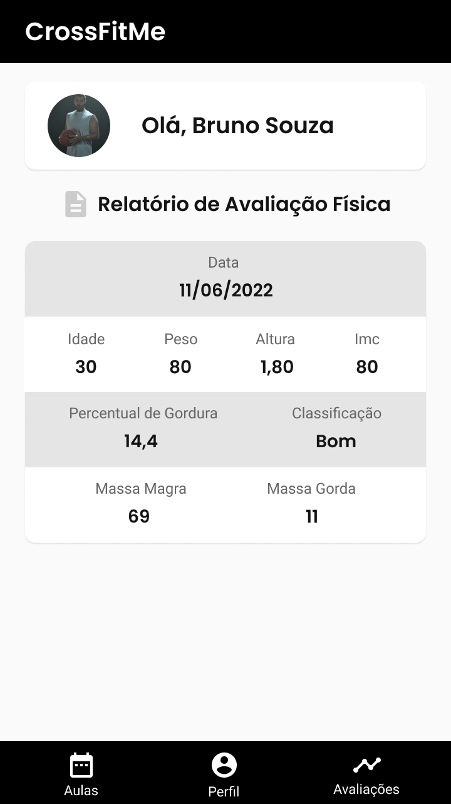

# Template Padrão da Aplicação

Layout padrão da aplicação que será utilizado em todas as páginas com a definição de identidade visual, aspectos de responsividade e iconografia.

> Segue o modelo padrão [protótipo de telas] proposto para solução:

## 1. A tela Inicial do Aplicativo é formada por uma interface de login. A partir desta tela é possível fazer o cadastro do usuário no aplicativo. Por óbvio faz-se a autenticação do usuário, caso não seja o primeiro acesso.

## 2. Detalhes do usuário autenticado no sistema.

## 3. Tela que permite ao usuário agendar treinos em horários disponíveis, de acordo com data e lotação.

## 4. Tela que permite ao usuário visualizar seu relatório de avaliação física, conforme divulgado pelo instrutor de treino.

